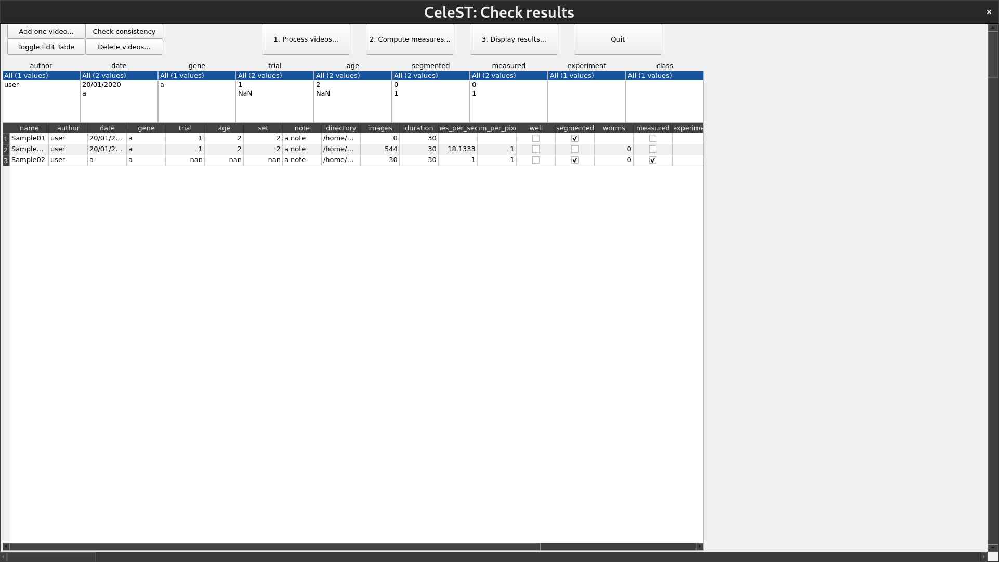

# Using CeleST for dummies


> ⚠️ **Work In Progress:** 


C Elegans Swim Tracker

### Prerequisites:

Firstly ensure you have installed celeST software and its dependencies as described here.

celeST runs matlab code and as a result needs a matlab interpreter. The version in this repo was modified to work with GNU octave.

### Step 1:

Open up a compatible version of octave and navigate to the celeST directory in the GUI.

it should look something like this once set up, note the path in the file browser


Load the needed packages by entering the following commands in the command window

```bash
pkg load io
```

and

```bash
pkg load image
```

### Step 2:

Run celeST by running this command in the command window

```bash
celeST
```

If all went well it should look something like this, pay attention to the warnings that may come up in the command window


### Step 3:

Add a video by clicking the “add one video” button on the top left

<aside>
💡 The term video is a bit confusing in this case, the correct input is a directory filled with tif images, a sample can be found [here.](http://celest.mbb.rutgers.edu/)

</aside>


It may need some action to refresh, but the video should appear below



### Step 4:

Next process the video by clicking the process video button


Select a video and click add to the list then click the video in the no swim well defined, a frame from the video should appear


define the swim well by clicking three points on the edge of the swim well


The video should now be listed under the swim well defined, next click process all the videos listed above.

This may take a few minutes.

once all frames are processed, the results will be saved and you can close the processing window

### Step 5:

Once the segmentation results are ready, click the compute measures button


Select the video and click load the segmentation result this may take a few minutes


You should then be able to check the worms one by one and validate or reject them


Once you have validated the appropriate worms, click save and compute measures this may take a good while, if the command window doesn’t show an error, its probably alright

once it is over, close the window

### Step 6:

You can now click the Display results and load the computed measures


then click show graphs for these samples and play around, the results are also available in a text file in a directory named “data”

### Step 7:

Make sure to close the app by clicking the quit button on the top right, this will make sure segmentation and measured results will be properly saved.