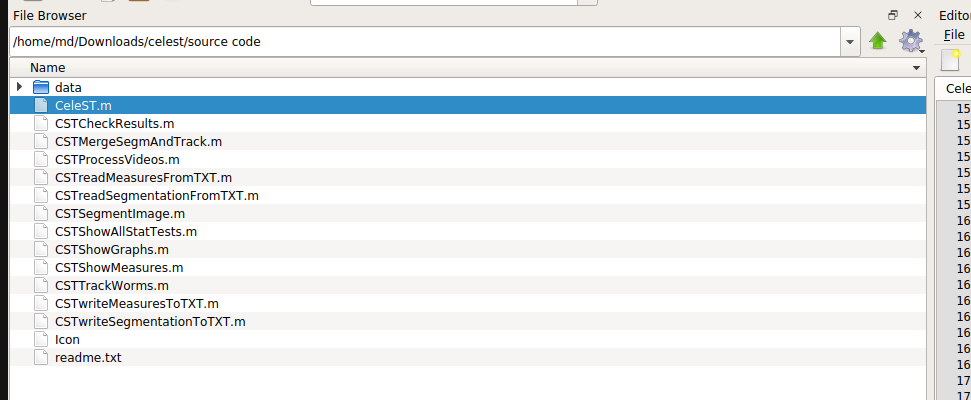
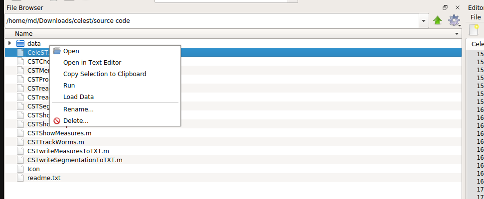

# Installation de l'environnement

- [Installation de l'environnement](#installation-de-lenvironnement)
  - [Introduction](#introduction)
  - [Installation d'Anaconda pour Python3.8](#installation-danaconda-pour-python38)
  - [Installation de WF_NTP](#installation-de-wf_ntp)
  - [Exécution de CeleST](#exécution-de-celest)
    - [Étapes préliminaires](#étapes-préliminaires)
    - [Octave](#octave)
    - [CeleST](#celest)
      - [Exécution](#exécution)
        - [Interface graphique](#interface-graphique)
        - [interface ligne de commande](#interface-ligne-de-commande)

## Introduction
Comme mentionné dans le Readme à la racine du répertoire, ce projet s'appuie sur 2 outils utilisés dans le monde de la recherche en biologie:
* [CeleST](https://dcs-lcsr.github.io/CeleST/) (version MacOS) qui est un programme développé en Matlab
* [WF\NTP](https://github.com/impact27/WF_NTP) qui est un programme développé en Python
À ce jour, ces 2 outils ne semblent plus être actif en terme de développement et maintenance mais restent tout de même utilisé par la communauté scientifique.

Dans les sections qui vont suivre sont détaillés les étapes d'installation pour **CeleST** et **WF\_NTP**.


## Installation d'Anaconda pour Python3.8

### Linux
1. télécharger le script d'installation d'anaconda (`wget -P /tmp https://repo.anaconda.com/archive/Anaconda3-2020.02-Linux-x86_64.sh`)
   > À noter que l'exécutable télécharger par la commande wget est pour un système dont l'architecture est x86 (pour vérifier tapper `arch` ou `uname -m` dans votre terminal)
2. ajouter les droits d'exécution à l'utilisateur (`sudo chmod u+x Anaconda3-2020.02-Linux-x86_64.sh`) et exécuter le script d'installation
3. Ajouter le répertoire `anaconda3/bin` au `PATH` en exportant celui-ci au sein de votre `bashrc` ou `zshrc` (`PATH="$HOME/anaconda3/bin:$HOME/.local/bin:$PATH"`)
4. fermer et réouvrir votre shell et lancer la commande `conda init bash` (ou `conda init zsh` en fonction de votre shell)
5. fermer et réouvrir votre shell encore une fois

L'installation est complète.

### Windows
1. Télécharger l'exécutable d'installation [Anaconda](https://www.anaconda.com/products/distribution) ou [Miniconda](https://docs.conda.io/en/latest/miniconda.html) pour Python 3.8.
2. Lancer l'exécutable et suivre les instructions jusqu'à ce que l'installation soit complète.

## Installation de WF_NTP

### Linux
0. Penser a telecharger les submodules du repository avec `git submodule update --init --recursive`
1. Créer un environement conda virtuel avec la commande `conda create -n v_wf_ntp python=3.8` et activer le (`conda activate  v_wf_ntp`)
1.1 Si vous utilisez miniconda a la place d'anaconda pensez a ajouter le channel conda-forge `conda config --append channels conda-forge`
2. Installer les différentes librairies rassemblées dans le fichier `conda_wf_ntp_requirements.txt` via la commande `conda install -f conda_wf_ntp_requirements.txt`
3. Copier le fichier `run_script/multiwormtracker_app` à la racine du répertoire `WF_NTP`
4. Ouvrir le fichier `WF_NTP/WF_NTP/WF_NTP_script.py` et  remplacer `coordinates='xy'` par `coordinates='rc'` à la ligne 287.

L'installation de `WF_NTP` est complète, vous pouvez lancer le programme avec la commande `./multiwormtracker_app`.

### Windows

#### Création de l'environnement conda
1. Ouvrir l'Anaconda Prompt et se placer dans le répertoire `Elegant-Elegans`
```
cd path\to\Elegant-Elegans
```
2. Créer un environnement conda virtuel `v_wf_ntp`, puis l'activer :
```
conda env create -f env_wf_ntp.yml
conda activate v_wf_ntp
```
    > L'environnement est bien activé si `v_wf_ntp` apparaît entre parenthèses au début de la ligne de commande.

#### Exécution
1. Dans l'Anaconda Prompt, se placer dans le répertoire `WF_NTP`
```
cd path\to\Elegant-Elegans\WF_NTP
```
2. Vérifier que l'environnement `v_wf_ntp` est bien activé et lancer le programme de `WF_NTP` avec la commande :
```
python multiwormtracker_app
```

## Exécution de CeleST
### Étapes préliminaires
Afin de pouvoir lancer CeleST, plusieurs étapes préliminaires sont nécessaires:
1. télécharger le code source à partir de http://celest.mbb.rutgers.edu/
2. installer le logiciel **Octave** ([ici](https://wiki.octave.org/Octave_for_GNU/Linux) pour les systèmes Linux ou encore [là](https://wiki.octave.org/Octave_for_macOS) pour MacOS)

### Octave
L'installation du logiciel Octave est simple.
Si vous êtes *root* et sous un système *Ubuntu*, vous avez simplement à effectuer les commandes:
```bash
apt install octave
apt install liboctave-dev  # development files
```
Pour un système Linux différent, vous trouverez la démarche sur la page [wiki d'Octave](https://wiki.octave.org/Octave_for_GNU/Linux)

Dans le cas où vous n'êtes pas *root*, il est possible d'installer Octave en tant que distribution indépendante au sein d'Anaconda.
Dans ce cas vous pouvez l'ajouter à l'environnement conda `v_wf_ntp`  (de sorte à avoir un environnement unique) où bien dans un second environnement conda.
Une fois l'environnement activé, effectué la commande:
```bash
conda install -c conda-forge octave
```
Il est également possible d'installer Octave avec `flatpak`:
```bash
flatpak install flathub org.octave.Octave
```

L'installation d'Octave est complète. Vous pouvez le lancer via votre centre d'applications.

### CeleST
1. décompresser l'archive `'source code.zip'`:
   ```bash
   unzip 'source code.zip' -d /path/to/the/desired/directory/celest
   ```
2. Le code de `CeleST` est en Matlab, de plus il a été rédigé il y a quelques années et ne semble pas être maintenu. Deux répertoires sont présents dans l'archive `CeleST`:
   *  `__MACOSX` (code source pour MacOS)
   *  `source code` (code source pour Linux)
   1. **Installation Linux**: Dans le répertoire contenant le code source (`source code`) effectué la modification suivante:
      ```bash
      # fichier CeleST.m ligne 174
      tableVideos = uitable(...,'ColumnEditable',[],...);
      # remplacer les crochets par:
      tableVideos = uitable(...,'ColumnEditable',false,...);
      ```
   2. **Installation MacOS**: #TODO

`CeleST` est prêt à être lancer avec `Octave`.

#### Exécution

##### Interface graphique

1. Lancer `Octave`
2. Modifier le répertoire courant afin que celui-ci soit le répertoire contenant le code source (voir image).

3. clique-droit sur le fichier `CeleST.m` et sélectionner `Run`:


L'interface de `CeleST` s'ouvre, vous pouvez alors utiliser le programme.

##### interface ligne de commande

1. `cd source_code`
2. `octave --eval "run(CeleST.m)"`

*Note: Les différentes étapes ont été réalisées sur un système Ubuntu22.04, a priori cela devrait être identique sur Ubuntu21.04*
