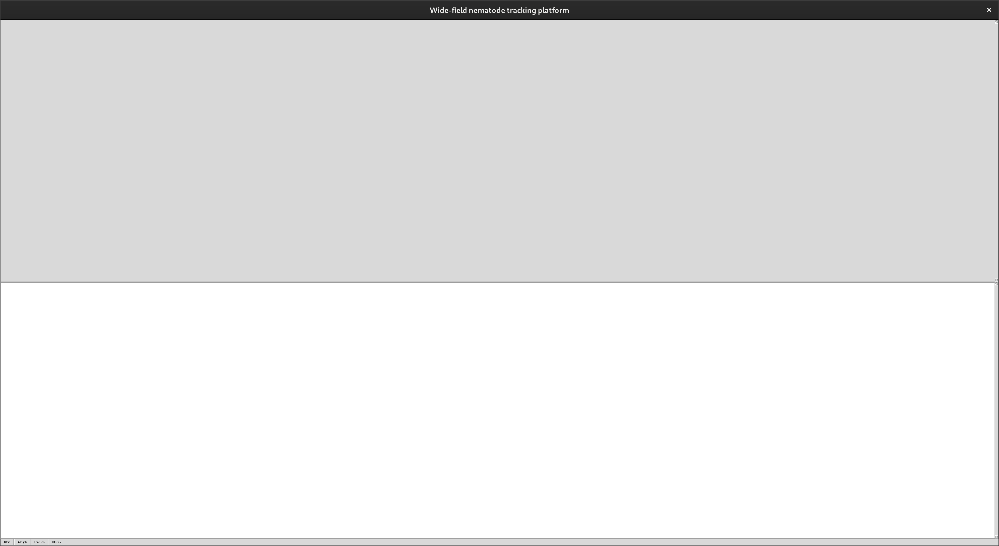
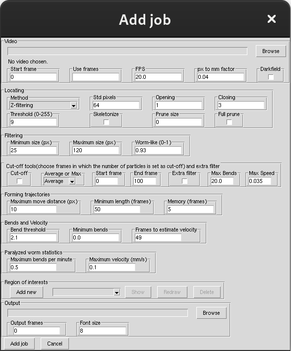
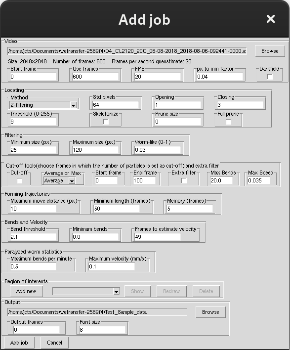
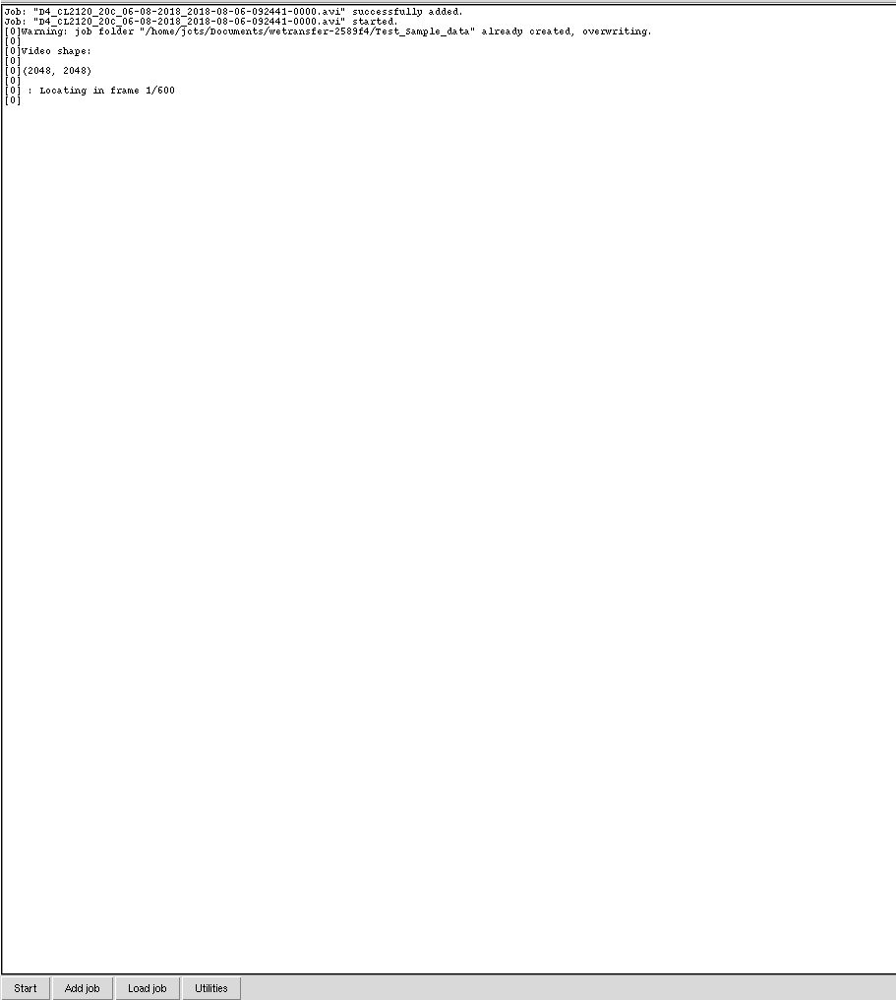

# Using  WF NTP for dummies

> ⚠️ **Work In Progress:**\
> 🚧 *still missing region selection* 🚧

(Wide Field nematode tracking software)

### Prerequisites:

Firstly ensure you have installed WFntp software and its dependencies as described [here](https://github.com/42-AI/Elegant-Elegans/blob/main/Setup.md).

### Step 1:

Launch WFntp by navigating to the WFntp directory and executing:

```bash
./multiwormtracker_app
```

At this point the gui (graphical user interface) should launch and look something like



It may render slightly differently with different screen resolutions.

> Troubleshooting!
> - I get error messages about a missing library
>    
>    Refer back to the installation documentation available [here](https://github.com/42-AI/Elegant-Elegans/blob/main/Setup.md).
>    
> - Nothing opens
>    - Make sure to use a compatible rendering server, Sway on linux will not work, but Xorg will

### Step 2:

Click the `“add job”` button on the bottom left a pop up window should open



At this point enter a video using `“browse”` and set the parameters, be sure to fill in the output section to wherever you would like the results to be saved.

> 💡 **Tips:**\
> If you do not have a suitable video to test with, you can download sample data [here](https://www.repository.cam.ac.uk/bitstream/handle/1810/299931/wetransfer-2589f4.zip?sequence=1&isAllowed=y).

below is an example of a valid job using the sample data available [here](https://www.repository.cam.ac.uk/bitstream/handle/1810/299931/wetransfer-2589f4.zip?sequence=1&isAllowed=y)



Finally click `"add job"`. If all went well, not much will happen, make sure to check the console for errors or warnings, ideally, you should get this message in the console:

```bash
Job: "D4_CL2120_20C_06-08-2018_2018-08-06-092441-0000.avi" successfully added.
```

### Step 3:

Now that the job is loaded the only thing left to do is to click start at the very bottom left!

The console should print some info about the video size and then “locating in frame …”

Be aware this may take a while, longer than you might think, if no error messages appear, let it do its thing.

Here’s an example of things going according to plan, it may be stuck on the first frame for several minutes, but should pick up some pace after that, processing time averaged about 15 minutes for my modern laptop.



### Step 4:

Once the processing is done its time to check the results! they should be located in a results.txt file in the output file you specified in step 2. An example of such a file is provided with the sample data [here](https://www.repository.cam.ac.uk/bitstream/handle/1810/299931/wetransfer-2589f4.zip?sequence=1&isAllowed=y).

