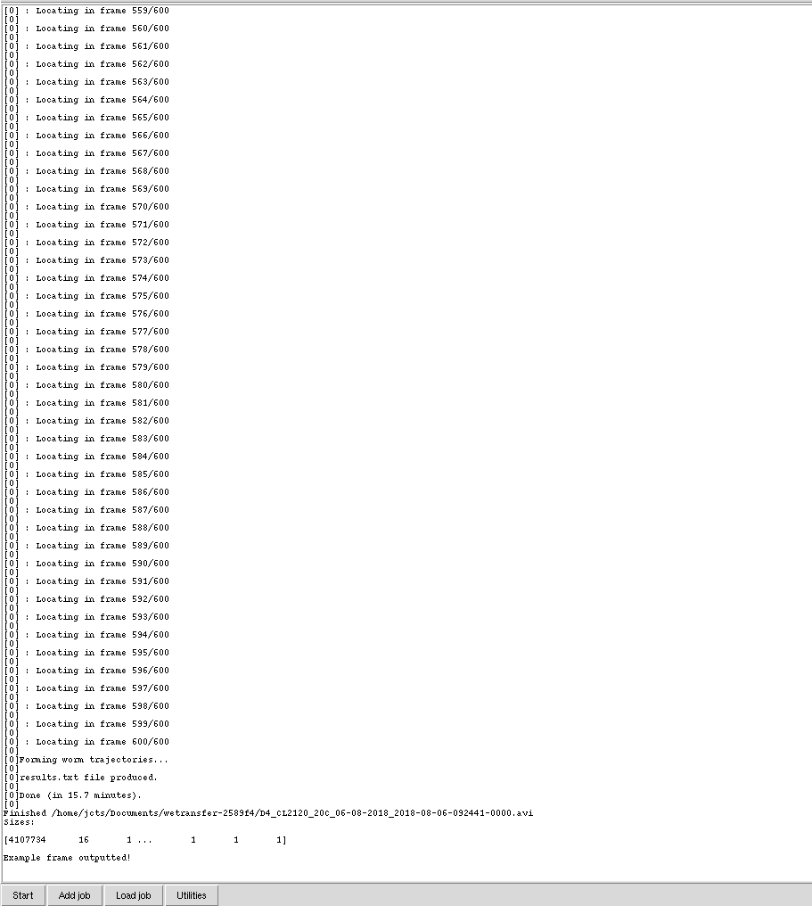

# Using  WF NTP for dummies

> ⚠️ **Work In Progress:**\
> 🚧 *still missing region selection* 🚧

(Wide Field nematode tracking software)

### Prerequisites:

Firstly ensure you have installed WFntp software and its dependencies as described [here](https://github.com/42-AI/Elegant-Elegans/blob/main/Setup.md).

### Step 1:

Launch WFntp by navigating to the WFntp directory and executing:

```bash
./multiwormtracker_app
```

At this point the gui (graphical user interface) should launch and look something like


It may render slightly differently with different screen resolutions.

> **Warning**
>
> - If one is getting error messages about a missing library:
>   - Refer back to the installation documentation available [here](https://github.com/42-AI/Elegant-Elegans/blob/main/Setup.md).
>   - If one has double check his setup. An issue on github can be open. You will need to detailled the issue you are dealing with.
>    
> - Nothing opens:
>   - Make sure to use a compatible rendering server, Sway on linux will not work, but Xorg will.

### Step 2:

Click the `“add job”` button on the bottom left a pop up window should open


At this point enter a video using `“browse”` and set the parameters, be sure to fill in the output section to wherever you would like the results to be saved.

> 💡 **Tips:**
>
> If you do not have a suitable video to test with, you can download sample data [here](https://www.repository.cam.ac.uk/bitstream/handle/1810/299931/wetransfer-2589f4.zip?sequence=1&isAllowed=y).

below is an example of a valid job using the sample data available [here](https://www.repository.cam.ac.uk/bitstream/handle/1810/299931/wetransfer-2589f4.zip?sequence=1&isAllowed=y)


Finally click `"add job"`. If all went well, not much will happen, make sure to check the console for errors or warnings, ideally, you should get this message in the console:

```bash
Job: "D4_CL2120_20C_06-08-2018_2018-08-06-092441-0000.avi" successfully added.
```

### Step 3:

Now that the job is loaded the only thing left to do is to click start at the very bottom left!

The console should print some info about the video size and then “locating in frame …”

Be aware this may take some times to processed a video.


|  |
| :--- |
| **Legend**: Beginning of the processing of a video. |

|  |
| :--- |
| **Legend**: Ongoing processing of a video. |

### Step 4:
Once the processing is done its time to check the results! they should be located in a `results.txt` and `particles.csv` files in the output file you specified in step 2. An example of such a file is provided with the sample data [here](https://www.repository.cam.ac.uk/bitstream/handle/1810/299931/wetransfer-2589f4.zip?sequence=1&isAllowed=y).

### Output directory:
The result of the analysis are saved in the directory you specified when filling the parameters of the job (step 2). One should find several jpg images (`0frameorigin.jpg`, `0z.jpg`, `1framesubstract.jpg`, `2thresholded.jpg`, `3opened.jpg`, `4closed.jpg`, `5labelled.jpg` and `6removed.jpg`) corresponding to the results of each preprocessing steps before the analyzing process and `results.txt` and `particles.csv` as one can see on the image below.

|  |
| :--- |
| **Legend**: Directory containing the output of processed video. |