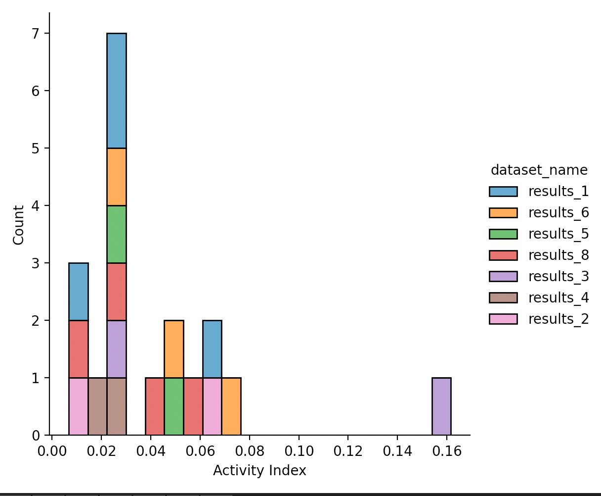

# Description
The goal is to plot the distribution of the activity index yielded by wfntp from several video samples.\

The images analyzed are pulled from aws buckets listed in `bucket_path.txt`.\
`make_videos.py` is a script used to pull images from these buckets and convert them in a mp4 video.\
This script uses the uncommented path in `bucket_path.txt`\
The settings used for each video inputed in wfntp and the outputs at worm level are available in `results/` for each video.\
`plot_activity_index.py` is a script used to plot the distribution of the results of the activity index from the `particles.csv` files available in `results/`

# Methodology

## Formula and implementation in wfntp
The formula of the activity index used is as follow:
$$
activity\_index = \frac{area}{\frac{2 \times 60}{BPM}} = \frac{area \times BPM}{120}
$$
In WF NTP, we use 2 variables to calculate the activity index:
* `area` corresponding to the total area covered by the worm (particle) in mm.
* `BPM` corresponding to the number of bends per minutes.
## Data and plotting
The data from each `particles.csv`in each subdirectory of `results/` are stacked to obtain mutliple measure of the activity index from several video samples.
Row with null value in the activity index field are removed from the dataset to better vizualize the distribution.

# Results

Plot of the distribution of the activity indeces extracted from each video (dataset_name)\

